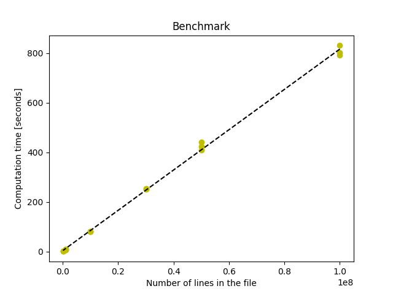

# Backend Engineering Challenge


Submission for the Unbabel Engineering Challenge. The goal is to create a CLI that calculates the average translation
duration within a moving window from a given input, with the translation metrics. 
Each line in the input is a JSON object with the following schema:

```json
{
	"timestamp": "2018-12-26 18:12:19.903159",
	"translation_id": "5aa5b2f39f7254a75aa4",
	"source_language": "en",
	"target_language": "fr",
	"client_name": "airliberty",
	"event_name": "translation_delivered",
	"duration": 20,
	"nr_words": 100
}
```
The output should be the average translation duration within a moving window of a given number of minutes, in 1-minute 
steps, in the following format:
```
{"date": "2018-12-26 18:11:00", "average_delivery_time": 0}
{"date": "2018-12-26 18:12:00", "average_delivery_time": 20}
...
```
> The following cases will be ignored, and the code will continue to the next line:
> - Malformed JSON line
> - JSON line with the wrong schema (e.g., empty timestamp)

## To Run
Install poetry and cli dependencies
```
pip install poetry
poetry install
```
Run the CLI with the appropriate inputs and chosen flags. Windows larger than 1e6 are not allowed.
```
usage: poetry run unbabel [-h] -i INPUT_FILE -w WINDOW_SIZE [-o OUTPUT_FILE] [-l {DEBUG,INFO,WARNING,ERROR}]

options:
  -h, --help            show this help message and exit
  -i INPUT_FILE, --input_file INPUT_FILE
                        Input file
  -w WINDOW_SIZE, --window_size WINDOW_SIZE
                        In minutes, specify the size of the moving window used for the aggregation
  -o OUTPUT_FILE, --output_file OUTPUT_FILE
                        Output file path
  -l {DEBUG,INFO,WARNING,ERROR}, --logger {DEBUG,INFO,WARNING,ERROR}
                        the logging level
```
## To Test

Run the following command to execute the unit tests and provide code coverage:
```
poetry run pytest --cov=src/app --cov-report term-missing
```

## Benchmarks

To generate benchmark files for testing, run:
```
usage: python benchmark/create_test_data.py [-h] -l LINES -d DAYS [-o OUTPUT]

options:
  -h, --help            show this help message and exit
  -l LINES, --lines LINES
                        the number of lines to generate
  -d DAYS, --days DAYS  the number of days in the file
  -o OUTPUT, --output OUTPUT
                        the name of the output file
```
Optionally, use the following script to create multiple files with the number of lines ranging 
from 100k to 100M (3 sets of each). This process may take some time:
```
bash benchmark/create_files.sh 
```
Afterward, use the run_all.sh script to run the CLI on all files in the benchmark/data folder. 
It runs for a 10-minute window:
```
bash benchmark/run_all.sh
```
For a Macbook Pro 2019, with an Intel Core i9 2.3 GHz, the run times achieved were as follows:
```
data_s100000000_d1: 0:13:12.298921
data_s100000000_d2: 0:13:22.223491
data_s100000000_d5: 0:13:51.128277
data_s50000000_d1:  0:06:50.130627
data_s50000000_d2:  0:07:21.523824
data_s50000000_d5:  0:07:03.976452
data_s30000000_d1:  0:04:12.558931
data_s30000000_d2:  0:04:13.078232
data_s30000000_d5:  0:04:13.144238
data_s10000000_d1:  0:01:20.282275
data_s10000000_d2:  0:01:21.057366
data_s10000000_d5:  0:01:20.870284
data_s1000000_d1:   0:00:08.328551
data_s1000000_d2:   0:00:07.891245
data_s1000000_d5:   0:00:08.262960
data_s100000_d1:    0:00:00.790489
data_s100000_d2:    0:00:00.829133
data_s100000_d5:    0:00:00.866571
data_example:       0:00:00.001341
```
